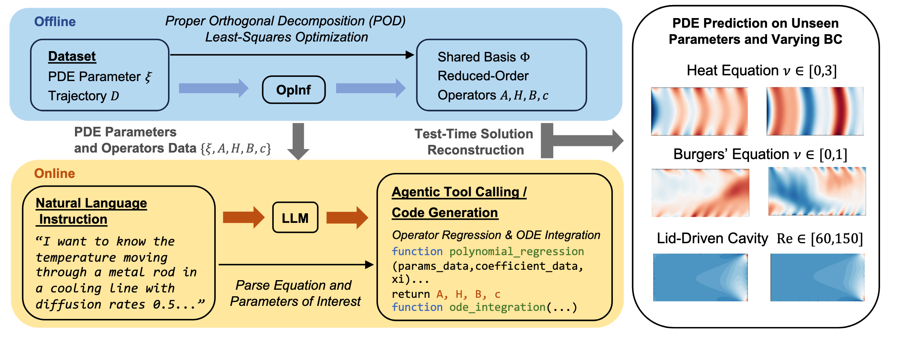

# OpInf-LLM 


Official implementation of the paper ["OpInf-LLM: Parametric PDE Solving with LLMs via Operator Inference"](https://arxiv.org/abs/2602.01493).



## Repository structure

- `llm/`: pure LLM baseline
- `src/`: OpInf-LLM workflows, ablations, and evaluation scripts
- `dataset/`: dataset-related scripts and local dataset files

The usage of each folder is documented in the README file located within each folder.


## Dataset download

Dataset can be downloaded from [here](https://drive.google.com/drive/folders/1xzj9oBgsc6a_ynAIFZ50HQUmpmIRHc-V?dmr=1&ec=wgc-drive-%5Bmodule%5D-goto).


## Citation

```
@article{wang2026opinf,
  title={OpInf-LLM: Parametric PDE Solving with LLMs via Operator Inference},
  author={Wang, Zhuoyuan and Hu, Hanjiang and Deng, Xiyu and Mowlavi, Saviz and Nakahira, Yorie},
  journal={arXiv preprint arXiv:2602.01493},
  year={2026}
}
```

